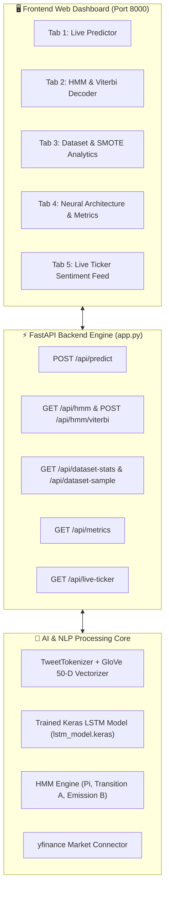

# 📘 Complete Walkthrough Document: Stock Trend Prediction & Sentiment AI Dashboard

**Course**: CPC353 Natural Language Processing & Speech (Assignment 2)  
**Institution**: Universiti Sains Malaysia (USM)  
**Branch**: `feature/interactive-dashboard-and-api-integration`

---

## 📑 Table of Contents
1. [Executive Summary](#-executive-summary)
2. [System Architecture](#-system-architecture)
3. [Quick Start Guide](#-quick-start-guide)
4. [Detailed Feature Walkthrough](#-detailed-feature-walkthrough)
   - [Tab 1: Live Stock Trend Predictor](#tab-1-live-stock-trend-predictor)
   - [Tab 2: Hidden Markov Model (HMM) Market Regimes](#tab-2-hidden-markov-model-hmm-market-regimes)
   - [Tab 3: Dataset & Preprocessing Analytics (SMOTE)](#tab-3-dataset--preprocessing-analytics-smote)
   - [Tab 4: Model Architecture & Performance Scorecard](#tab-4-model-architecture--performance-scorecard)
   - [Tab 5: Live Market Feeds & Yahoo Finance Stream](#tab-5-live-market-feeds--yahoo-finance-stream)
5. [Step-by-Step Viva / Demo Test Scenarios](#-step-by-step-viva--demo-test-scenarios)
6. [API Reference & Technical Specifications](#-api-reference--technical-specifications)
7. [Troubleshooting & FAQ](#-troubleshooting--faq)

---

## 📌 Executive Summary

This project implements an end-to-end Natural Language Processing (NLP) and Deep Learning system to forecast financial market movements from textual news and tweets. The platform combines:
* **Text Processing & Vectorization**: TweetTokenizer paired with 50-dimensional **GloVe** word embeddings (`glove-wiki-gigaword-50`).
* **Deep Neural Network**: A 6-layer **LSTM** model with Dropout and Softmax classification yielding **91.90% test accuracy**.
* **Statistical Regime Modeling**: Dynamic **Hidden Markov Model (HMM)** transition and emission matrices with an interactive **Viterbi sequence decoder**.
* **Modern Web Interface**: A high-performance, dark-themed Single-Page Application (SPA) built using **Tailwind CSS**, **Chart.js**, **Lucide Icons**, and served via **FastAPI**.

---

## 🏛️ System Architecture



---

## 🚀 Quick Start Guide

### Launching the Dashboard
Execute the launcher script in your project root:
```bash
python run_frontend.py
```
*(This automatically initializes the backend, loads cached GloVe weights, and opens your browser).*

*Direct Launch Alternative:*
```bash
python app.py
```
Access URL: **[http://127.0.0.1:8000](http://127.0.0.1:8000)**

---

## 🔍 Detailed Feature Walkthrough

### Tab 1: Live Stock Trend Predictor
Allows users to analyze custom news headlines or pre-loaded financial scenarios:
* **Scenario Presets**: Instantly populate the input box with realistic market announcements:
  * 🚀 *Earnings Jump 10.87%* (Bullish)
  * 📉 *Profit Plunge & Fraud Investigation* (Bearish)
  * ⚖️ *Routine Board of Directors Meeting* (Neutral)
  * 💼 *Billion-Dollar Tech Acquisition* (Bullish)
* **NLP Pipeline Inspector**:
  * Step 1: Normalizes text by lowercasing and stripping non-alphanumeric punctuation.
  * Step 2: Generates interactive token badges showing every tokenized term and whether it exists in the GloVe vocabulary.
* **Output Card**:
  * Displays the predicted trend category: **Uptrend (> +10%)**, **Flat (-10% to +10%)**, or **Downtrend (< -10%)**.
  * Shows real-time trading recommendation (**BULLISH 🚀**, **NEUTRAL ⚖️**, **BEARISH 📉**).
  * Interactive Chart.js bar graph depicting the Softmax probability distribution.

---

### Tab 2: Hidden Markov Model (HMM) Market Regimes
Translates textual and market volatility observations into hidden market regimes:
* **Initial State Distribution ($\pi$)**: Displays the baseline probability vector ($\text{Flat}: 92.69\%$, $\text{Uptrend}: 5.12\%$, $\text{Downtrend}: 2.19\%$).
* **State Transition Matrix ($A$)**: An interactive $3 \times 3$ grid visualizing $P(\text{State}_t \mid \text{State}_{t-1})$ with dynamic blue intensity shading.
* **Emission Matrix ($B$)**: Switch between observation types:
  1. *Price Volatility* (Low / Med / High Volatility)
  2. *Day of the Week* (Monday through Friday)
  3. *Headline Word Count* (Short / Medium / Long)
* **Interactive Viterbi Path Decoder**:
  * Add observations to a time-series sequence: $O = [O_1, O_2, \dots, O_T]$.
  * Click **"Decode Most Likely State Path"** to execute dynamic programming and reveal the most probable hidden market path with step-by-step state likelihoods.

---

### Tab 3: Dataset & Preprocessing Analytics (SMOTE)
Demonstrates the data engineering pipeline from Part 1 of the assignment:
* **Data Splits Summary**:
  * Train: $16,685$ samples ($70\%$)
  * Validation: $4,768$ samples ($20\%$)
  * Test: $2,384$ samples ($10\%$)
* **SMOTE Resampling Chart**: Compares the original imbalanced class distribution against synthetic over-sampling.
* **Price Distribution**: Interactive line chart plotting price change percentages.
* **Interactive Data Table**: Search and filter records from `train_data_final.csv`, `val_data_final.csv`, `test_data_final.csv`, or raw `stock_trend.csv` by trend type.

---

### Tab 4: Model Architecture & Performance Scorecard
Details the deep learning topology and test evaluation results:
* **6-Layer Network Pipeline**:
  $$\text{Input}(30, 50) \longrightarrow \text{LSTM}(64) \longrightarrow \text{Flatten} \longrightarrow \text{Dense}(32, \text{ReLU}) \longrightarrow \text{Dropout}(0.5) \longrightarrow \text{Dense}(3, \text{Softmax})$$
* **Performance Scorecard**:
  * **Test Accuracy**: **$91.90\%$**
  * **Macro Avg F1**: $0.364$
  * **Weighted Avg F1**: $0.892$
* **10-Epoch Learning Curves**: Graphs training and validation accuracy/loss across all training epochs.
* **Confusion Matrix Heatmap**: $3 \times 3$ matrix showing ground truth versus predicted classifications.

---

### Tab 5: Live Market Feeds & Yahoo Finance Stream
Integrates real-world market data via `yfinance`:
* **Ticker Search**: Type any symbol (e.g. `AAPL`, `TSLA`, `NVDA`, `TOPGLOV.KL`, `MAYBANK.KL`).
* **Live Price & Change**: Displays the latest traded price and daily percentage move.
* **Real-time News Sentiment**: Automatically fetches current financial news headlines and executes the LSTM model on each article.
* **Inspect Button ($\nearrow$)**: Instantly transfers any live article into Tab 1 for detailed tokenization and probability analysis.

---

## 🧪 Step-by-Step Viva / Demo Test Scenarios

| Test Case | Tab | Input / Action | Expected Result |
| :--- | :--- | :--- | :--- |
| **1. Bullish News** | `Live Predictor` | *"Top Glove reports record 150% surge in quarterly net profit and special dividend payout."* | **Signal**: `BULLISH 🚀`<br>**Prediction**: `uptrend` |
| **2. Bearish News** | `Live Predictor` | *"Securities commission launches fraud probe into accounting irregularities as shares collapse 22%."* | **Signal**: `BEARISH 📉`<br>**Prediction**: `downtrend` |
| **3. Neutral News** | `Live Predictor` | *"Axiata holds annual general meeting to review regular governance and audit compliance."* | **Signal**: `NEUTRAL ⚖️`<br>**Prediction**: `flat` |
| **4. HMM Viterbi** | `HMM Regimes` | Build: `[High Volatility, Low Volatility, High Volatility]` $\rightarrow$ Click **Decode** | Trajectory: `Uptrend ➔ Flat ➔ Uptrend` with path probability. |
| **5. Live Ticker** | `Live Feeds` | Enter `AAPL` or `TSLA` $\rightarrow$ Click **Fetch** | Displays current price and sentiment labels for live news articles. |

---

## 🔌 API Reference & Technical Specifications

| Method | Endpoint | Query / Body Params | Returns |
| :--- | :--- | :--- | :--- |
| `POST` | `/api/predict` | `{"text": string, "company": string}` | Prediction label, signal, confidence, probabilities, tokens |
| `GET` | `/api/hmm` | `observation_type=volatility\|day_of_week\|title_length` | $\pi$ vector, Transition Matrix $A$, Emission Matrix $B$ |
| `POST` | `/api/hmm/viterbi` | `{"observations": string[], "observation_type": string}` | Optimal state trajectory, joint path probability, step details |
| `GET` | `/api/metrics` | None | Test accuracy, classification report, confusion matrix, history |
| `GET` | `/api/dataset-stats` | None | Raw and split sample counts, SMOTE distribution, price histogram |
| `GET` | `/api/dataset-sample` | `split=train\|val\|test\|raw`, `trend=all\|uptrend...` | Paginated records with column attributes |
| `GET` | `/api/live-ticker` | `symbol=AAPL` | Current price, percentage change, analyzed headlines |

---

## ❓ Troubleshooting & FAQ

* **Q: I opened `static/index.html` directly and got a connection error.**  
  **A**: When opened as `file://`, the browser may block network requests if the Python backend is not active. Run `python run_frontend.py` or `python app.py`, and visit `http://127.0.0.1:8000`.

* **Q: Port 8000 is already in use.**  
  **A**: You can change the port in `app.py` or `run_frontend.py` to `port=8080` or `port=8501`.

* **Q: Where are the trained model files stored?**  
  **A**: In the [`model_artifacts/`](file:///c:/Users/danni/OneDrive/Desktop/USM/sem%205/CPC353/Stock-trend-prediction-with-news-sentiment/model_artifacts/) directory (`lstm_model.keras`, `metrics.json`, `dataset_summary.json`).
